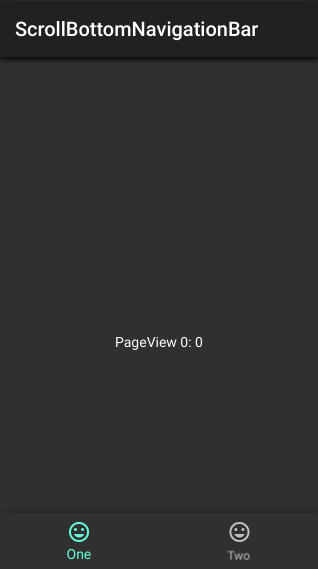

ScrollBottomNavigationBar
=========================

Hide or show bottom navigation bar while scrolling

Getting Started
---------------

First, add this line in your project's `pubspec.yaml`

```yaml
dependencies:
  ...
  scroll_bottom_navigation_bar:
```
For help getting started with Flutter, view the online [documentation](https://flutter.io/).

Usage Examples
--------------

### Basic implementation

```dart
import 'package:flutter/material.dart';
import 'package:scroll_bottom_navigation_bar/scroll_bottom_navigation_bar.dart';

void main() {
  runApp(App());
}

class App extends StatelessWidget {
  final controller = ScrollBottomNavigationBarController();

  @override
  Widget build(BuildContext context) {
    return MaterialApp(
      home: Scaffold(
        body: ScrollBody(
          controller: controller,
          builder: (context, index) => Container(
            height:
                MediaQuery.of(context).size.height + kBottomNavigationBarHeight,
            child: Center(
              child: Text("Simple $index"),
            ),
          ),
        ),
        bottomNavigationBar: ScrollBottomNavigationBar(
          controller: controller,
          items: [
            BottomNavigationBarItem(
              icon: Icon(Icons.mood),
              title: Text("One"),
            ),
            BottomNavigationBarItem(
              icon: Icon(Icons.mood),
              title: Text("Two"),
            ),
          ],
        ),
      ),
    );
  }
}
```

You can also check the [example](./example) for additional information.

Snapshots
---------

