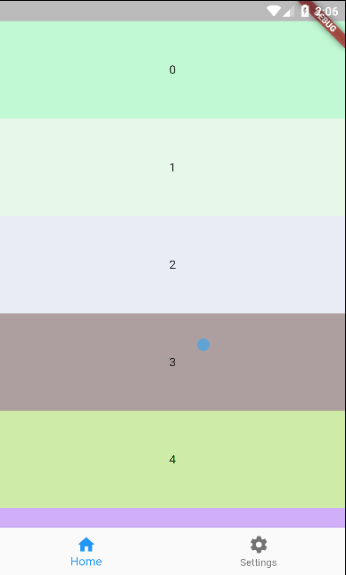
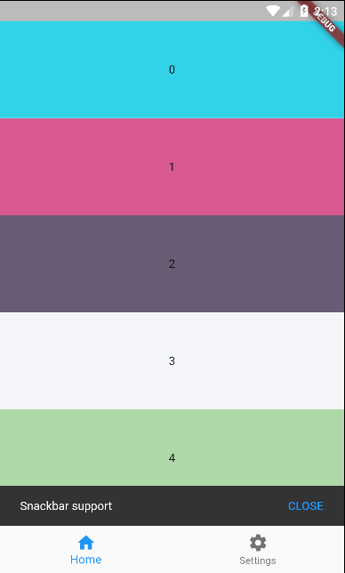
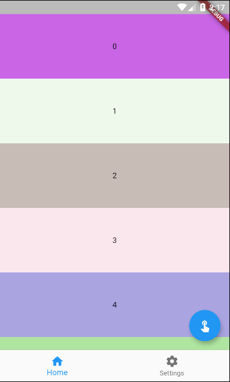
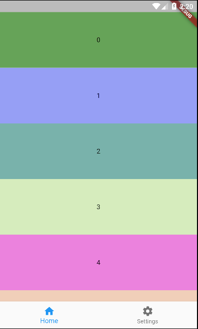

# ScrollBottomNavigationBar

Hide or show bottom navigation bar while scrolling.

## Roadmap

This is currently our roadmap, please feel free to request additions/changes.

| Feature                       | Progress |
| :---------------------------- | :------: |
| Scrollable                    |    ✅     |
| Supports FAB                  |    ✅     |
| Supports Snackbar             |    ✅     |
| Gradient background           |    ✅     |
| Pin/unpin                     |    ✅     |
| Snap/unsnap                   |    ✅     |
| Auto change page              |    ✅     |
| Change page by controller     |    ✅     |
| Listen page changes           |    ✅     |
| Custom scroll controller      |    ✅     |
| Auto attach scroll controller |    ✅     |
| Animated transitions          |    🔜     |

## Usage

### Getting started

Add `scroll_bottom_navigation_bar` package to your project. You can do this following [this steps](https://pub.dev/packages/scroll_bottom_navigation_bar#-installing-tab-).

### Basic implementation

First, you need a `ScrollBottomNavigationBarController` instance. If you need a custom `ScrollController`, you can pass the instance on constructor.

```dart
final controller = ScrollBottomNavigationBarController(); 
```

Now, you can use the `ScrollBottomNavigationBar` widget in a `Scaffold` widget, and attach `ScrollController` instance in your scrollable widget on body.

For simplify your code, you can use the `ScrollBody` widget as your scrollable widget. This widget takes care of exchanging items from the bottom bar.

> **_NOTE:_**  Showing only essencial code. See [example](#example) section to a complete implementation.

```dart
@override
Widget build(BuildContext context) {
  return Scaffold(
    body: ScrollBody(
      scrollBottomNavigationBarController: controller,
      builder: (context, index) => container(index),
    ),
    bottomNavigationBar: ScrollBottomNavigationBar(
      scrollBottomNavigationBarController: controller,
      items: items,
    ),
  );
}
```
### ScrollBottomNavigationBarController

You can use the ScrollBottomNavigationBarController instance to manage the behavior of the bottom navigation bar.

```dart
// Custom scroll controller
final scrollController = ScrollController();

final controller = ScrollBottomNavigationBarController(
  scrollController: scrollController,
  snap: true, // snap effect
); 
```

**Change page**
```dart
controller.changePage(page);
```

**Check pin state**
```dart
controller.isPinned;
```

**Pin**
```dart
controller.setPinState(true);
```

**Unpin**
```dart
controller.setPinState(false);
```

**Toogle pin state**
```dart
controller.tooglePin();
```

**Check snap state**
```dart
controller.snap;
```

**Snap**
```dart
controller.setSnapState(true);
```

**Unsnap**
```dart
controller.setSnapState(false);
```

**Toogle snap state**
```dart
controller.toogleSnap();
```

**Listen page changes**
```dart
controller.pageListener((index) => print(index));
```

**Dispose**
```dart
controller.dispose();
```

### Example

You can also check the [example](./example) for additional information.

## Snapshots




