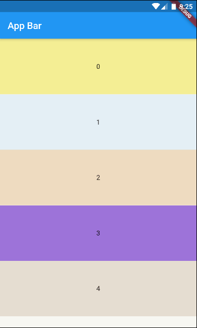

# Scroll app bar

Hide or show app bar while scrolling. This package works without custom scroll views and slivers.

## Why this package?

This package has the same result of default way that use a custom scroll view widget with a floating sliver app bar.

So, why I should use this package?

Because de default way don't works well in all cases. For example, if you have page views and  list views inside of the pages.

This package grant you more control and you can use this in more cases. Also, you can use this widget in a scaffold app bar, that turns your code more simple.

## Usage

### Getting started

Add `scroll_app_bar` package to your project. You can do this following [this steps](https://pub.dev/packages/scroll_app_bar#-installing-tab-).

### Basic implementation

First, you need a `ScrollAppBarController` instance. If you need a custom `ScrollController`, you can pass the instance on constructor.

```dart
final scrollAppBarController = ScrollAppBarController(); 
```

Now, you can use the `ScrollAppBar` widget in a `Scaffold` widget, and atach `ScrollController` instance in your scrollable widget on body.

> **_NOTE:_**  Showing only essencial code. See [example](#example) section to a complete implementation.

```dart
Scaffold(
  extendBodyBehindAppBar: true,
  appBar: ScrollAppBar(
    scrollAppBarController: scrollAppBarController,
    ...
  ),
  body: ListView.builder(
    controller: scrollAppBarController.scrollController, 
    ...
  ),
)
```

### Example

See a [complete example](./example).

## Snapshots


